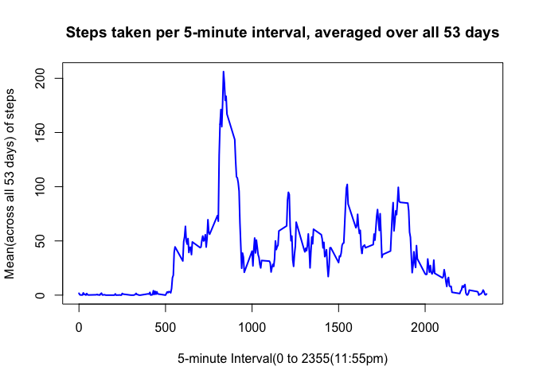
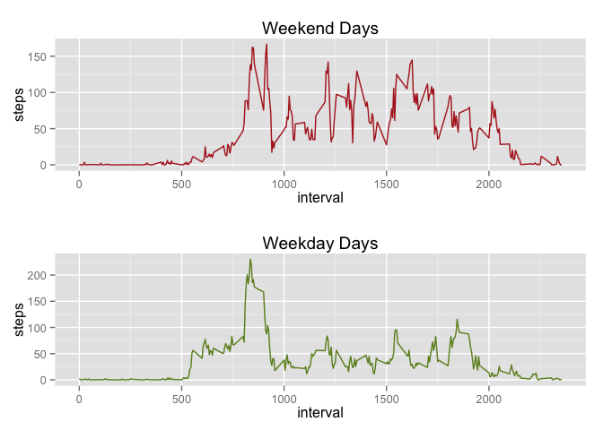

# Reproducible Research: Peer Assessment 1


## Loading and preprocessing the data
After forking and cloning the github repo, I unzipped the data and loaded it in.

```r
data <- read.csv("activity.csv")
```


## What is mean total number of steps taken per day?
The mean total number of steps per day is **10766.19** and the median is **10765**


```r
total_steps_per_day <- aggregate(steps ~ date, data, sum, na.rm = TRUE)
hist(total_steps_per_day$steps, main = "Total steps per day", xlab = "daily steps")
```

 

```r
mean(total_steps_per_day$steps)
```

```
## [1] 10766.19
```

```r
median(total_steps_per_day$steps)
```

```
## [1] 10765
```

## What is the average daily activity pattern?

The 5-minute time interval with highest activity (averaged over all days) is **8:35 AM to 8:40 AM**. The daily pattern is as shown in the histogram, and looks about as we would expect. Peak exercise time is in the morning, then some mid-level peaks through out the day and it peters out at the end.


```r
# Average daily activity pattern
avg_steps_per_interval <- aggregate(steps ~ interval, data, mean, na.rm = TRUE)

# Plot the time-series data
plot(avg_steps_per_interval$interval, avg_steps_per_interval$steps, 
     type ="l", 
     col = "blue", 
     lwd = "2", 
     xlab = "5-minute Interval(0 to 2355(11:55pm)", 
     ylab = "Mean(across all 53 days) of steps", 
     main = "Steps taken per 5-minute interval, averaged over all 53 days")
```

 

```r
# Which 5-minute interval is most active, on average
max_row_id <- which.max(avg_steps_per_interval$steps)
avg_steps_per_interval[max_row_id, ]$interval
```

```
## [1] 835
```

```r
# answer is 8:35AM to 8:40AM
```


## Imputing missing values
1. There are **2304** rows with NAs.
2. We replaced each NA with the average (over all days) for the 5-minute interval of the NA value.So, if for day 1, interval 5, the value is missing, we replace it with the average interval 5 value across all days where it is not NA.
3. This did not change the mean, as expected, but it did change the median which is now **10766.19**. This makes sense since we have introduced more "average behaviour" with our imputation method.
4. The histogram that results after imputation is below.

```r
missing_value_rows <- nrow(data) - sum(complete.cases(data))
# Imputation. Replace each NA with the mean of THAT interval.
newdata <- data
for (i in 1:nrow(newdata)) {
  if(is.na(newdata[i,]$steps)) {
    # what is the avg for this interval
    int <- newdata[i,]$interval
    m = int %% 100
    hr = (int - m)/100
    ind <- (hr *12) + (m/5) + 1
    newdata[i,]$steps <- avg_steps_per_interval[ind,]$steps
  }
}

# total steps by day
new_total_steps_per_day <- aggregate(steps ~ date, newdata, sum, na.rm = TRUE)
mean(new_total_steps_per_day$steps)
```

```
## [1] 10766.19
```

```r
median(new_total_steps_per_day$steps)
```

```
## [1] 10766.19
```

```r
# historgam of these values
hist(new_total_steps_per_day$steps, main = "Imputed NAS: Total steps per day", xlab = "daily steps")
```

 


## Are there differences in activity patterns between weekdays and weekends?

**Yes!!** As shown by the plot below, there are two major differences.
1. The morning peak time is WAY more pronounced during weekdays which makes sense since people try and get their workouts out of their work days.
2. Weekdays, the activity seems strenous in the morning (more strenous than in weekends) but on weekends, there are many peaks indicating many spurts of activity throughout which makes sense as we are out and about, hiking, biking etc without work obligations.

```r
weekday_str <- function(date_string) {
  if ((as.POSIXlt(date_string)$wday %% 6) != 0) {
    return("weekday")
  } else {
    return("weekend")
  }
}

# Add the weekend/weekday factor column to our data.
newdata$wknd <- lapply(newdata$date, weekday_str)

# subset the data by the new factor variable
wknd_data <- subset(newdata, newdata$wknd == "weekend")
wday_data <- subset(newdata, newdata$wknd == "weekday")
wknd_avg_steps_per_interval <- aggregate(steps ~ interval, wknd_data, mean, na.rm = TRUE)
wday_avg_steps_per_interval <- aggregate(steps ~ interval, wday_data, mean, na.rm = TRUE)

library("ggplot2")
myplot1<-ggplot(wknd_avg_steps_per_interval,
                aes(interval, steps))+geom_line(color="firebrick")+labs(title="Weekend Days")
myplot2<-ggplot(wday_avg_steps_per_interval,
                aes(interval, steps))+geom_line(color="olivedrab")+labs(title = "Weekday Days")
library("grid")
pushViewport(viewport(layout = grid.layout(2, 1)))
print(myplot1, vp = viewport(layout.pos.row = 1, layout.pos.col = 1))
print(myplot2, vp = viewport(layout.pos.row = 2, layout.pos.col = 1))
```

 
